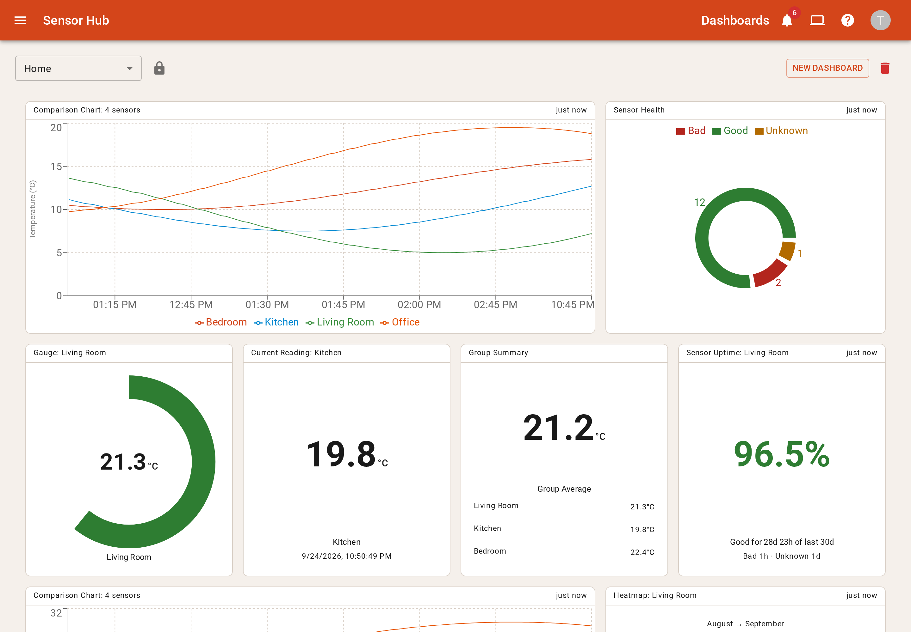
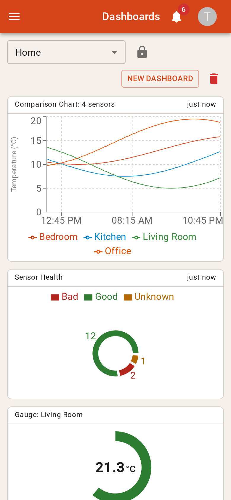

# Sensor Hub

A self-hosted home monitoring and control platform that runs happily on a Raspberry Pi. Point your Zigbee devices at it and every reading in the house lands in one place. It keeps the history, tells you when something's off, switches your plugs and lights, and gives you dashboards shaped however you like. There's a CLI and an AI assistant skill too, so you can just ask it about your house.

It started life as a couple of DS18B20 temperature probes wired to some Pi Zeros. It has evolved a bunch since then, and these days most of the house talks to it over Zigbee. I also use this repo as a playground for trying out workflows and hardware, so expect it to keep changing.



<p align="center">
  
</p>

## What it does

- Plugs straight into Zigbee2MQTT. There's an MQTT broker built in, so you don't need to run Mosquitto unless you want to, and new devices show up on their own and wait for you to approve them.
- Controls things too. Smart plugs, bulbs and switches get an on/off toggle.
- Dashboards you arrange yourself, from a range of widgets: charts, gauges, heatmaps, live readings and plenty more.
- Alerts and notifications. Threshold rules on any measurement, with rate limiting, and notifications in the app and by email.
- Keeps the history tidy. Old readings get aggregated so long time ranges stay quick, with a global retention period and per-sensor overrides.
- Proper multi-user. Users, roles, permissions, API keys and session management.
- Works from the terminal and from AI assistants. There's a full CLI, plus skill files that teach Claude or Copilot how to drive it (more on that below).
- Observable. It exports metrics, logs and traces over OpenTelemetry. I point mine at OpenObserve.

## My setup

For a feel of what this looks like in real life, this is how I run it:

- A Raspberry Pi 5, with the arm64 `.deb` from the releases page.
- nginx in front for TLS, with Pi-hole handling DNS so it's reachable by name on the home network.
- A Zigbee coordinator running Zigbee2MQTT, publishing to Sensor Hub's embedded broker. That covers temperature and humidity sensors in most rooms, door contacts, smart plugs and a few lights and switches.
- OpenObserve collecting the telemetry, so I can see what it's up to.
- The CLI on my laptop, with the Claude skill installed, so I can ask things like "is the humidity in any room over the last month creating a risk of damp?" or have it build me a new dashboard.

## Installing

Grab the `.deb` or `.rpm` for your architecture (amd64 or arm64) from the [releases page](https://github.com/tom-molotnikoff/sensor-hub/releases). Everything's signed, and the checksums are published alongside.

```bash
# Debian / Ubuntu / Raspberry Pi OS
sudo apt install ./sensor-hub_*_linux_arm64.deb

# Fedora / RHEL
sudo dnf install ./sensor-hub_*_linux_amd64.rpm
```

The package sets up a systemd service, config lives in `/etc/sensor-hub/` and the SQLite database lives in `/var/lib/sensor-hub/`. You'll want nginx in front for TLS.

The docs cover the rest:

- [Prerequisites](docs/docs/prerequisites.md)
- [Installation](docs/docs/installation.md)
- [nginx setup](docs/docs/nginx-setup.md)
- [Upgrading](docs/docs/upgrading.md)
- [Connecting a Zigbee device](docs/docs/how-to/connect-zigbee-device.md)

## CLI and AI assistants

The same binary doubles as a CLI. If you only want the CLI on another machine, there's a lightweight `sensor-hub-cli` package. Point it at your instance once with `sensor-hub config init`, and everything comes back as JSON:

```bash
sensor-hub health
sensor-hub sensors list
sensor-hub readings between --sensor Office_Temp_Hum --start 2026-09-20 --end 2026-09-24
sensor-hub alerts create --sensor-id 17 --measurement-type-id 1 --type HIGH_TEMP --threshold 28
sensor-hub dashboards update 1 --file dashboard.json
```

To let an AI assistant use it, install the skill file:

```bash
sensor-hub skills install --target claude    # or --target copilot, or --all
```

After that you can just ask it to check sensors, build dashboards or set up alerts in plain English. See [LLM skills](docs/docs/llm-skills.md) and the [CLI reference](docs/docs/cli.md).

## Hacking on it

The whole dev stack, with fake sensors, hot reload and Delve for debugging, runs from one Compose file:

```bash
docker compose -f sensor_hub/docker_tests/docker-compose.yml up --build
```

A few other handy bits:

```bash
./scripts/build-packages.sh          # unsigned snapshot .deb/.rpm in dist/ (needs GoReleaser)

cd sensor_hub && go test ./...       # Go unit tests
cd sensor_hub && go test -tags integration -timeout 300s ./integration/

cd sensor_hub/ui/sensor_hub_ui
npm run lint && npm test             # UI lint and unit tests
npm run test:layout                  # Playwright tests against a real server

cd docs && npm install && npm run start   # the docs site
```
